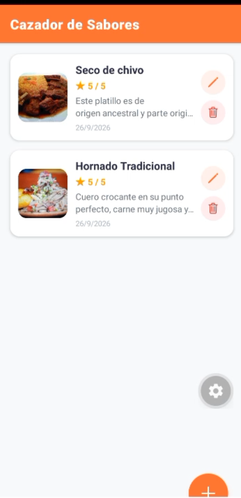
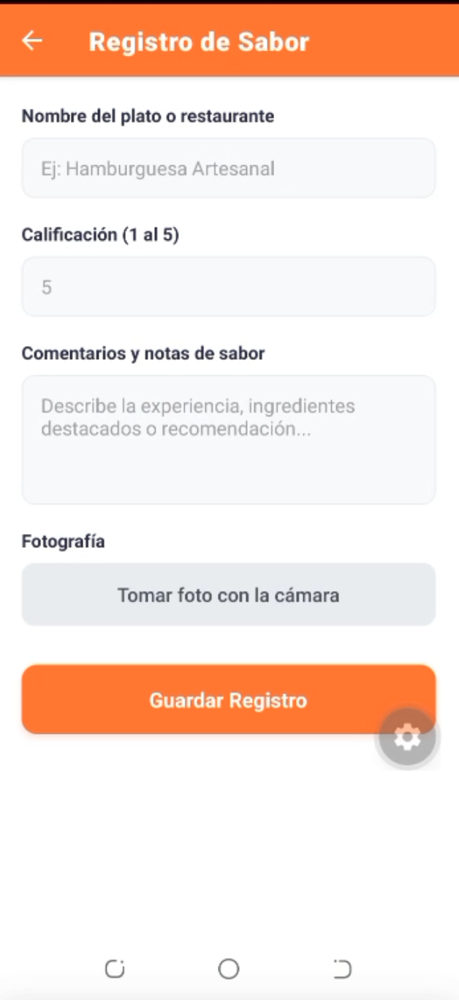
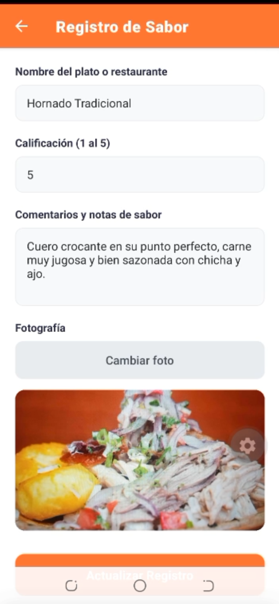
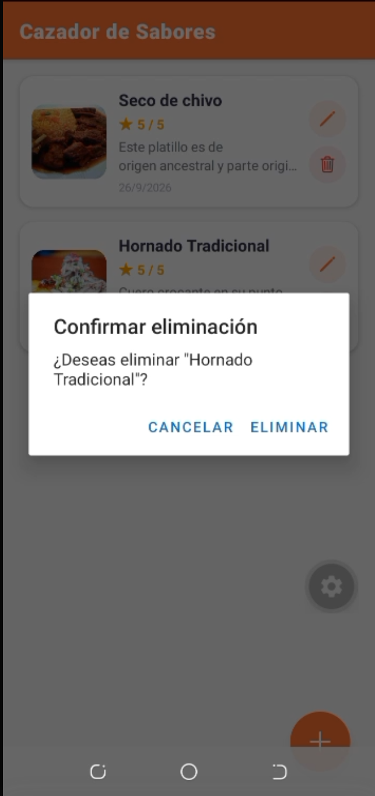

# 🍔 Cazador de Sabores - App 100% Offline (CRUD con SQLite)

Aplicación móvil desarrollada con React Native, Expo y TypeScript, diseñada para funcionar **completamente sin conexión a internet**, utilizando **SQLite** como base de datos local en el dispositivo. 

Este proyecto representa el reto final del módulo, implementando un CRUD completo (Crear, Leer, Actualizar, Eliminar) con captura de imágenes mediante la cámara del celular y navegación nativa entre pantallas.

---

## 📦 Descripción del Proyecto

La aplicación permite a los usuarios registrar sus experiencias culinarias (o cualquier tipo de registro con foto) de forma local. Implementa una arquitectura robusta separando la lógica de base de datos, las pantallas y el enrutamiento principal.

* **Pantalla Principal - Catálogo (`ListaScreen.tsx`):**
  * Listado reactivo con `FlatList` alimentado desde la base de datos SQLite.
  * Recarga automática de datos al volver a la pantalla (usando `navigation.addListener('focus', ...)`).
  * Botón flotante (con ícono `➕`) para navegar al formulario de creación.
  * Botones de acción con íconos (`✏️` para editar, `🗑️` para eliminar) sin usar texto, según los requisitos de diseño.
* **Pantalla Inteligente (`FormularioScreen.tsx`):**
  * Formulario unificado que sirve tanto para **Crear** como para **Editar** registros.
  * Detección automática del modo edición mediante el parámetro `idEdicion` recibido por navegación.
  * Integración de hardware con `expo-image-picker` para capturar fotos con la cámara en formato Base64 y previsualización inmediata.
  * Lógica condicional en la función de guardado: ejecuta un `INSERT` si es nuevo o un `UPDATE` si se está editando.

---

## 🕹️ Tecnologías Implementadas

* React Native
* Expo
* TypeScript
* @react-navigation/native
* @react-navigation/native-stack
* expo-sqlite
* expo-image-picker
* react-native-safe-area-context
* react-native-screens

---

## 📸 Capturas de Pantalla y Video Demostrativo

A continuación se presentan las evidencias visuales del funcionamiento de la aplicación, ubicadas en la carpeta `Entregables`:

| Pantalla Principal (Catálogo) | Formulario de Registro |
| :---: | :---: |
|  |  |

| Edición de Registro | Confirmación de Eliminación |
| :---: | :---: |
|  |  |

🎥 **Video Funcional de la App:**
[Ver Video Funcional](./Entregables/video-funcional.mp4)


---

## 🔧 Instalación y Uso

Para poder ejecutar el proyecto, sigue los siguientes pasos:

1. Clona el repositorio desde la terminal:
   ```bash
   git clone https://github.com/luisAristeguieta/CazadorApp.git
   cd CazadorApp

2. Instala las dependencias del proyecto:
    ```bash
    npm install

3. Inicia la aplicación móvil:
    ```bash
    npx expo start

Escanea el código QR con la aplicación Expo Go en tu celular (Android/iOS) para probar la app.

Este proyecto fue desarrollado con fines exclusivamente educativos como parte de un taller práctico de desarrollo móvil Fullstack Offline. No está destinado a uso comercial ni a producción en su estado actual. El código y la arquitectura implementados tienen como objetivo demostrar el dominio de las tecnologías utilizadas (React Native, Expo, SQLite y React Navigation) en un entorno controlado de estudio.